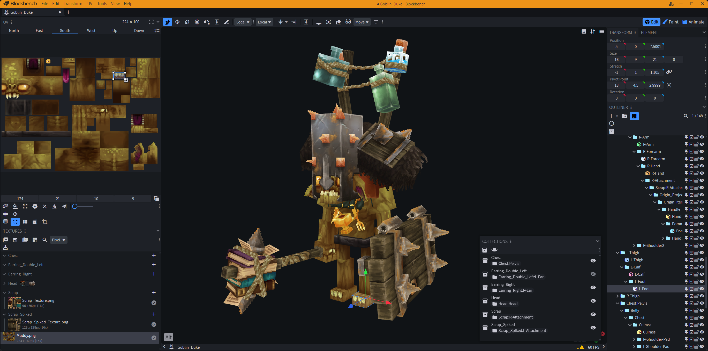

# Blockbench Hytale Plugin

Welcome to the repository for the Hytale Models plugin for Blockbench!

This plugin adds support for the `.blockymodel` and `.blockyanim` file formats that can be used to create and edit models for Hytale.
It also adds a number of Hytale specific features and general quality-of-life features and tweaks.

You can report issues on the [Issues Page](https://github.com/JannisX11/hytale-blockbench-plugin/issues).
